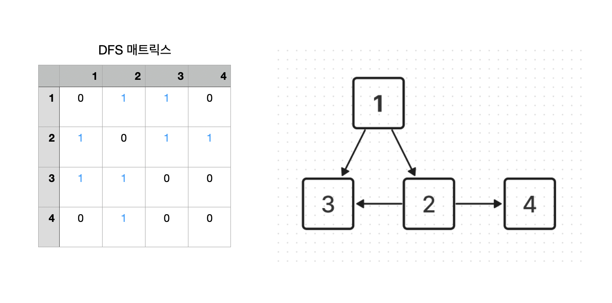

# 백준 2606

### 바이러스

그래프 자료구조와 그래프 탐색 문제이다.

예제로 입력 값이 다음과 같을 경우

```bash
$ cargo r
4
4
1 2
1 3
2 3
2 4
```

아래 그림과 같은 구조의 그래프가 형성된다.



>DFS 매트릭스는 그래프의 관계를 설명하는 2차원 배열

#### DFS(Depth-First Search): 깊이 우선 탐색 알고리즘

그래프를 탐색할 때 기본적으로 2가지 방법이 있다.

- ✅ 주변에 관계된 노드부터 체크하면서 내려갈 것이가?
- ✅ 아래로 내려가면서 체크할 것인가?

다음을 예로 🐥를 찾아보자

```javascript
const matrix = [
  [🐕, 🐥, 🐥],
  [🐥, 🐕, 🐕],
  [🐕, 🐕, 🐥]
];
```

좌우 옆부터 탐색한다.

```
[1] 🐕 -> 🐥 -> 🐥, ... 첫 번째 배열 탐색 끝
[2] 🐥 -> 🐕 -> 🐕, ... 두 번째 배열 탐색 끝
[3] 🐕 -> 🐕 -> 🐥, ... 세 번째 배열 탐색 끝

모든 탐색을 완료하였다 🐥🐥🐥
```

또다른 방법은 아래부터 탐색하는 방법이다.

```
[1]🐕 -> [2]🐥 -> [3]🐕, ... 첫 번째 ~ 세 번째 배열을 각각 0번째 인덱스를 탐색
[1]🐥 -> [2]🐕 -> [3]🐕, ...
[1]🐥 -> [2]🐕 -> [3]🐥, ...

모든 탐색을 완료하였다 🐥🐥🐥
```

이 방법은 자료구조를 탐색하는 방향을 봤을 때 점점 깊게 내려간다. 때문에 "깊이 우선 탐색"이라고 부른다.

(사실 그래프와 무관한 설명이지만 이해를 돕기 위해..)

#### DFS 장점

- "너비 우선 탐색"보다 구현이 쉽다.(단순한 스택구조를 활용함)
- 각각 탐색한 길의 특징을 저장(Memoization)할 수 있다.
